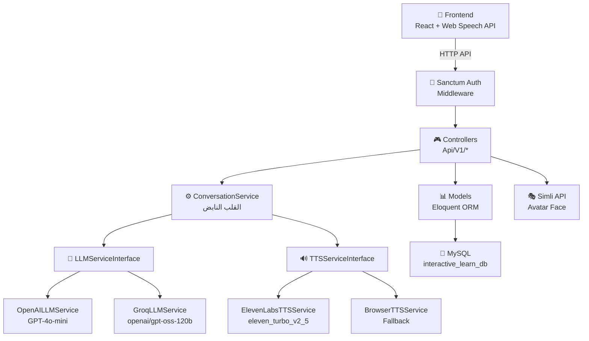
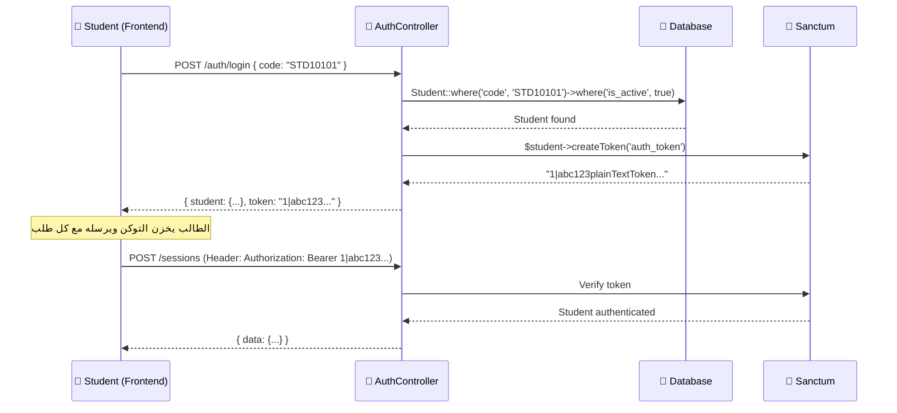
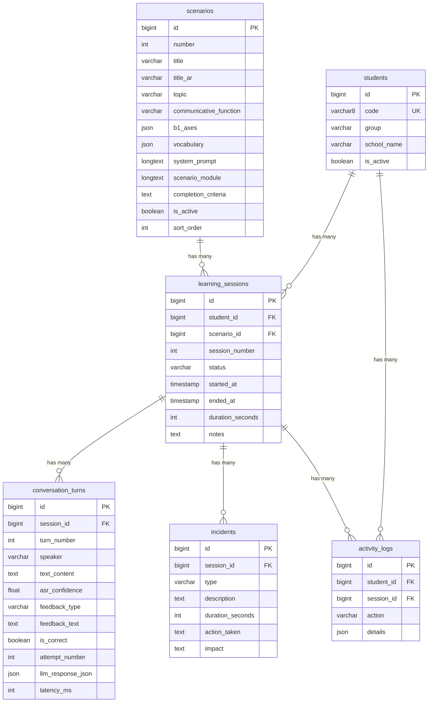
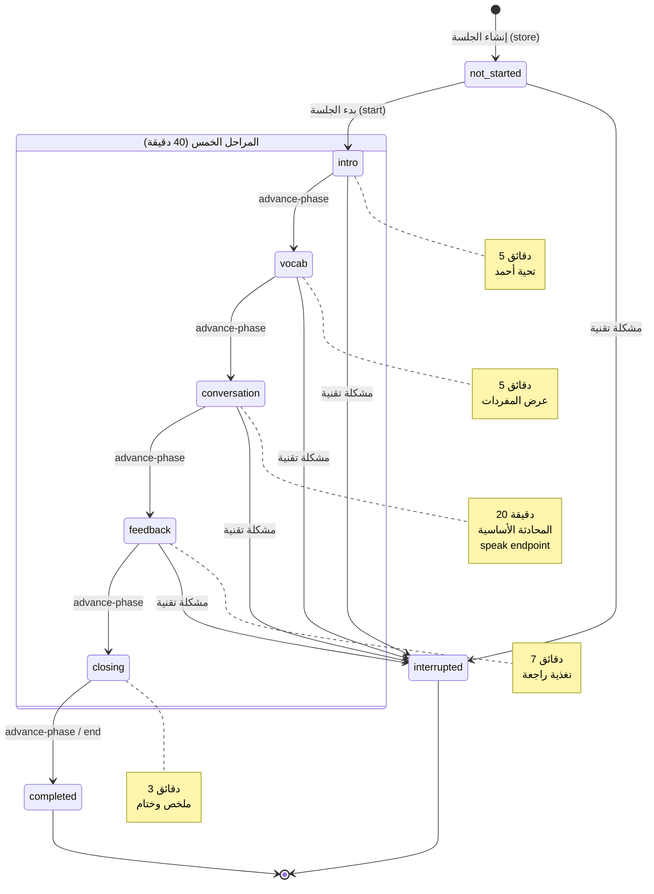
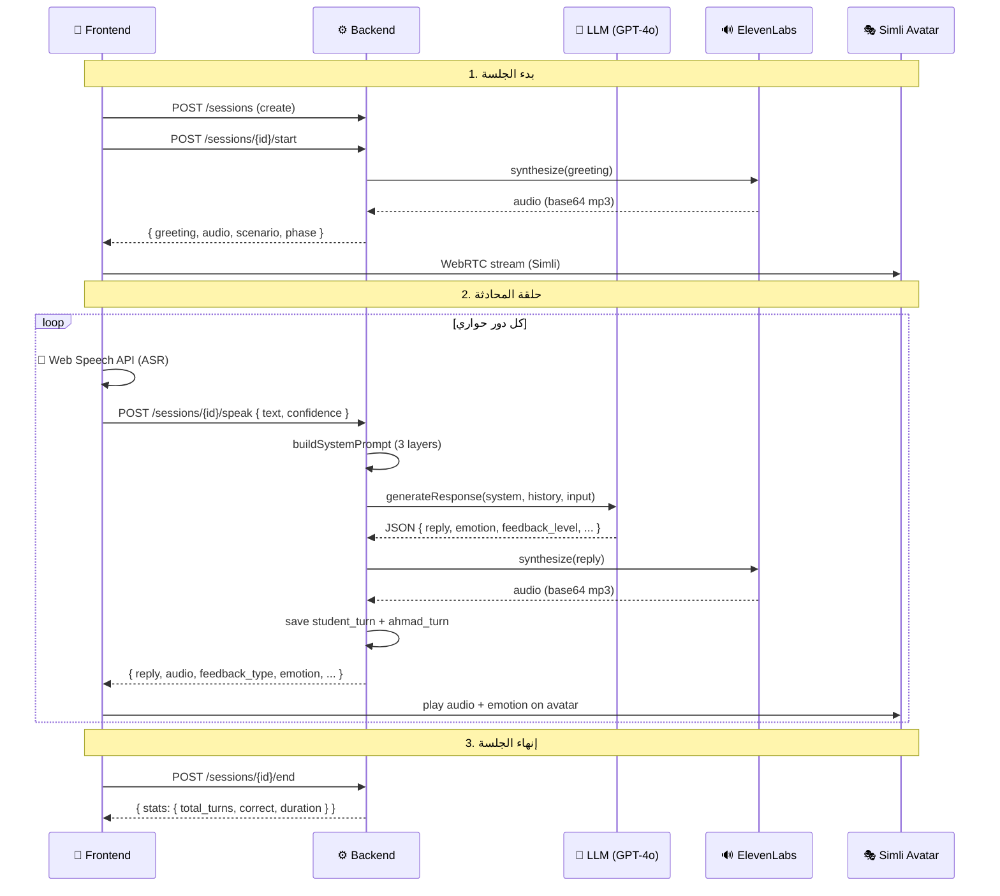

# 📘 التوثيق الشامل للباك إند — بيئة التعلم التفاعلية

> **المشروع:** AI-Powered Interactive English Learning Environment  
> **الإطار:** Laravel 12.0 (PHP 8.2+) + Filament 5.7 + Sanctum 4.3  
> **قاعدة البيانات:** MySQL (interactive_learn_db)  
> **المسار:** `D:\laragon\www\interactive-learning`  
> **آخر تحديث:** سبتمبر 2026

---

## 📑 فهرس المحتويات

1. [نظرة عامة على المشروع](#1--نظرة-عامة-على-المشروع)
2. [هيكل المشروع](#2--هيكل-المشروع)
3. [البنية المعمارية (Architecture)](#3--البنية-المعمارية-architecture)
4. [قاعدة البيانات — Migrations](#4--قاعدة-البيانات--migrations)
5. [الموديلات (Models)](#5--الموديلات-models)
6. [التعدادات (Enums)](#6--التعدادات-enums)
7. [الخدمات (Services)](#7--الخدمات-services)
8. [الكنترولرات (Controllers)](#8--الكنترولرات-controllers)
9. [المسارات (Routes / API Endpoints)](#9--المسارات-routes--api-endpoints)
10. [نظام المصادقة (Authentication)](#10--نظام-المصادقة-authentication)
11. [لوحة الإدارة (Filament Admin)](#11--لوحة-الإدارة-filament-admin)
12. [البيانات التجريبية (Seeders)](#12--البيانات-التجريبية-seeders)
13. [الخدمات الخارجية (External APIs)](#13--الخدمات-الخارجية-external-apis)
14. [إعدادات البيئة (.env)](#14--إعدادات-البيئة-env)
15. [الحزم والتبعيات (Dependencies)](#15--الحزم-والتبعيات-dependencies)
16. [Postman Collection](#16--postman-collection)
17. [مخطط علاقات الكيانات (ERD)](#17--مخطط-علاقات-الكيانات-erd)
18. [دورة حياة الجلسة (Session Lifecycle)](#18--دورة-حياة-الجلسة-session-lifecycle)

---

## 1. 🔭 نظرة عامة على المشروع

هذا المشروع هو **بيئة تعلم تفاعلية مدعومة بالذكاء الاصطناعي** لتدريب طلاب المرحلة الثانوية في السعودية (أبها) على مهارات المحادثة بالإنجليزية وفق مستوى **CEFR B1**.

### الفكرة الأساسية:
- الطالب يتحدث مع **وكيل افتراضي اسمه "أحمد"** (AI Avatar)
- أحمد يستخدم **LLM** (OpenAI GPT-4o-mini أو Groq) لتوليد الردود
- النظام يحوّل **الصوت لنص** (ASR) عبر Web Speech API في المتصفح
- يحوّل **النص لصوت** (TTS) عبر ElevenLabs API
- يعرض **وجه أحمد المتحرك** عبر Simli AI (WebRTC)
- يوجد **8 سيناريوهات** تعليمية مبنية على منهج Mega Goal 1
- نظام **تغذية راجعة تدريجي من 3 مستويات**: Recast → Clarification → Model
- كل جلسة **40 دقيقة** مقسمة لـ 5 مراحل زمنية

### السياق البحثي:
المشروع مبني لخدمة **بحث أكاديمي** يقارن بين مجموعة تجريبية (تستخدم البيئة) ومجموعة ضابطة. الباحث: أحمد الحياني - جامعة الملك خالد (KKU).

---

## 2. 📂 هيكل المشروع

```
interactive-learning/
├── app/
│   ├── Enums/                          ← التعدادات (5 ملفات)
│   │   ├── FeedbackType.php
│   │   ├── IncidentType.php
│   │   ├── SessionStatus.php
│   │   ├── StudentGroup.php
│   │   └── TurnStatus.php
│   ├── Filament/                       ← لوحة الإدارة
│   │   ├── Resources/
│   │   │   ├── ScenarioResource.php    + Pages/
│   │   │   ├── SessionResource.php     + Pages/ + RelationManagers/
│   │   │   └── StudentResource.php     + Pages/
│   │   └── Widgets/
│   │       └── StatsOverview.php
│   ├── Http/Controllers/Api/V1/        ← الكنترولرات (4 كنترولرات)
│   │   ├── AuthController.php
│   │   ├── ConversationController.php
│   │   ├── ScenarioController.php
│   │   └── SessionController.php
│   ├── Models/                         ← الموديلات (7 موديلات)
│   │   ├── ActivityLog.php
│   │   ├── ConversationTurn.php
│   │   ├── Incident.php
│   │   ├── Scenario.php
│   │   ├── Session.php
│   │   ├── Student.php
│   │   └── User.php
│   ├── Providers/
│   │   ├── AppServiceProvider.php      ← ربط الـ Contracts بالتطبيقات
│   │   └── Filament/AdminPanelProvider.php
│   └── Services/                       ← طبقة الخدمات (6 + 3 عقود)
│       ├── Contracts/
│       │   ├── ASRServiceInterface.php
│       │   ├── LLMServiceInterface.php
│       │   └── TTSServiceInterface.php
│       ├── BrowserASRService.php
│       ├── BrowserTTSService.php
│       ├── ConversationService.php     ← القلب النابض
│       ├── ElevenLabsTTSService.php
│       ├── GroqLLMService.php
│       └── OpenAILLMService.php
├── config/
│   └── services.php                    ← إعدادات APIs الخارجية
├── database/
│   ├── migrations/                     ← 10 ملفات migration
│   └── seeders/
│       ├── DatabaseSeeder.php
│       └── ScenarioSeeder.php
├── routes/
│   └── api.php                         ← مسارات الـ API
├── .env                                ← إعدادات البيئة
├── composer.json                       ← التبعيات
└── Interactive_Learning_API.postman_collection.json
```

---

## 3. 🏗️ البنية المعمارية (Architecture)

### نمط التصميم: Service Layer Pattern مع Dependency Injection



### المبادئ المستخدمة:

| المبدأ | التطبيق |
|--------|---------|
| **Dependency Injection** | كل الخدمات تُحقن عبر الـ Constructor أو الـ Method Injection |
| **Interface Contracts** | 3 عقود (ASR, LLM, TTS) تسمح بتبديل التطبيقات بسهولة |
| **Service Provider Binding** | `AppServiceProvider` يربط كل عقد بتطبيقه الفعلي |
| **Graceful Fallback** | لو الـ API فشل، النظام يرجع لـ Simulator (Mock) |
| **Enum-Based State Machine** | حالات الجلسة مُدارة بـ PHP 8.1 Backed Enums |
| **Route Model Binding** | Laravel يحل الـ Models تلقائياً من الـ URL |

### ربط العقود بالتطبيقات (`AppServiceProvider`):

```php
// app/Providers/AppServiceProvider.php

$this->app->bind(ASRServiceInterface::class,  BrowserASRService::class);
$this->app->bind(LLMServiceInterface::class,  OpenAILLMService::class);
$this->app->bind(TTSServiceInterface::class,  ElevenLabsTTSService::class);
```

> [!NOTE]
> يمكن تبديل `OpenAILLMService` بـ `GroqLLMService` بتغيير سطر واحد فقط في الـ Provider.

---

## 4. 💾 قاعدة البيانات — Migrations

### نظرة عامة: 10 ملفات Migration تُنشئ 13 جدول

الجداول الأساسية للمشروع هي 6 جداول مخصصة + 7 جداول Laravel الافتراضية.

---

### 4.1 جدول `students` — الطلاب

**الملف:** [2026_08_29_170000_create_students_table.php](file:///D:/laragon/www/interactive-learning/database/migrations/2026_08_29_170000_create_students_table.php)

| العمود | النوع | الوصف |
|--------|-------|-------|
| `id` | `BIGINT UNSIGNED AI PK` | رقم الطالب التلقائي |
| `code` | `VARCHAR(8) UNIQUE` | الكود الرمزي (مثل `STD10101`) — **بديل اسم المستخدم وكلمة السر** |
| `group` | `VARCHAR(255)` | المجموعة: `experimental` (تجريبية) أو `control` (ضابطة) |
| `school_name` | `VARCHAR(255)` | اسم المدرسة (5 مدارس في أبها) |
| `is_active` | `BOOLEAN DEFAULT TRUE` | هل الطالب نشط؟ (لو انسحب نعطّله بدل الحذف) |
| `created_at` | `TIMESTAMP` | وقت الإنشاء |
| `updated_at` | `TIMESTAMP` | وقت آخر تعديل |

> [!IMPORTANT]
> الطالب يدخل بالـ `code` فقط — **لا يوجد كلمة سر**. هذا تصميم مقصود لتسهيل الاستخدام على طلاب الثانوي.

---

### 4.2 جدول `scenarios` — السيناريوهات التعليمية

**الملف:** [2026_08_29_170001_create_scenarios_table.php](file:///D:/laragon/www/interactive-learning/database/migrations/2026_08_29_170001_create_scenarios_table.php)

| العمود | النوع | الوصف |
|--------|-------|-------|
| `id` | `BIGINT UNSIGNED AI PK` | رقم تلقائي |
| `number` | `INTEGER` | رقم السيناريو (1-8) حسب خطة ADDIE |
| `title` | `VARCHAR(255)` | عنوان بالإنجليزي (يظهر للطالب) |
| `title_ar` | `VARCHAR(255)` | عنوان بالعربي (واجهة التنقل) |
| `topic` | `VARCHAR(255)` | الموضوع العام |
| `communicative_function` | `VARCHAR(255)` | الوظيفة التواصلية المستهدفة |
| `b1_axes` | `JSON` | محاور التقييم حسب CEFR B1 |
| `vocabulary` | `JSON` | المفردات المستهدفة |
| `system_prompt` | `LONGTEXT` | 🔑 **التعليمات الكاملة للـ AI** — شخصية أحمد وقواعده |
| `scenario_module` | `LONGTEXT` | تفاصيل الموقف الحواري (الأسئلة وتسلسل المحادثة) |
| `completion_criteria` | `TEXT` | معيار إكمال المهمة |
| `is_active` | `BOOLEAN DEFAULT TRUE` | مفعّل/معطّل |
| `sort_order` | `INTEGER` | ترتيب العرض |
| `created_at/updated_at` | `TIMESTAMPS` | |

> [!TIP]
> الـ `system_prompt` هو **أهم عمود** — يحتوي على كل تعليمات شخصية أحمد، قواعد الحوار (R1-R10)، وبروتوكول التغذية الراجعة التدريجي من 3 مستويات.

---

### 4.3 جدول `learning_sessions` — جلسات التعلم

**الملف:** [2026_08_29_170002_create_sessions_table.php](file:///D:/laragon/www/interactive-learning/database/migrations/2026_08_29_170002_create_sessions_table.php)

> [!NOTE]
> الجدول اسمه `learning_sessions` وليس `sessions` لتجنب التعارض مع جدول `sessions` الافتراضي في Laravel.

| العمود | النوع | الوصف |
|--------|-------|-------|
| `id` | `BIGINT UNSIGNED AI PK` | رقم الجلسة |
| `student_id` | `FK → students(id) CASCADE` | ربط بالطالب — لو الطالب اتحذف، جلساته تتحذف |
| `scenario_id` | `FK → scenarios(id) NULL ON DELETE` | ربط بالسيناريو — nullable لجلسات المراجعة (9) والتأمل (10) |
| `session_number` | `INTEGER` | رقم الجلسة (1-10) |
| `status` | `VARCHAR DEFAULT 'not_started'` | **حالة الآلة (State Machine)** — أنظر القسم 18 |
| `started_at` | `TIMESTAMP NULLABLE` | وقت بدء الجلسة |
| `ended_at` | `TIMESTAMP NULLABLE` | وقت انتهاء الجلسة |
| `duration_seconds` | `INTEGER NULLABLE` | المدة بالثواني (يتحسب تلقائياً) |
| `notes` | `TEXT NULLABLE` | ملاحظات المشرف |
| `created_at/updated_at` | `TIMESTAMPS` | |

---

### 4.4 جدول `conversation_turns` — أدوار المحادثة

**الملف:** [2026_08_29_170003_create_conversation_turns_table.php](file:///D:/laragon/www/interactive-learning/database/migrations/2026_08_29_170003_create_conversation_turns_table.php)

| العمود | النوع | الوصف |
|--------|-------|-------|
| `id` | `BIGINT UNSIGNED AI PK` | رقم تلقائي |
| `session_id` | `FK → learning_sessions(id) CASCADE` | ربط بالجلسة |
| `turn_number` | `INTEGER` | رقم الدور في المحادثة (1, 2, 3...) |
| `speaker` | `VARCHAR` | مين اتكلم: `'student'` أو `'avatar'` |
| `text_content` | `TEXT NULLABLE` | النص المنطوق |
| `audio_url` | `VARCHAR NULLABLE` | رابط ملف الصوت (اختياري) |
| `asr_confidence` | `FLOAT NULLABLE` | نسبة ثقة التعرف على الكلام (0.0 → 1.0) |
| `feedback_type` | `VARCHAR DEFAULT 'none'` | نوع التغذية الراجعة: `none/recast/clarification/model` |
| `feedback_text` | `TEXT NULLABLE` | شرح التغذية الراجعة |
| `is_correct` | `BOOLEAN NULLABLE` | هل كلام الطالب صحيح؟ |
| `attempt_number` | `INTEGER DEFAULT 1` | رقم المحاولة (1-3 كحد أقصى) |
| `llm_response_json` | `JSON NULLABLE` | الرد الخام الكامل من الـ AI |
| `latency_ms` | `INTEGER NULLABLE` | زمن استجابة الـ AI بالميلي ثانية |
| `created_at/updated_at` | `TIMESTAMPS` | |

> [!IMPORTANT]
> هذا الجدول هو **أهم جدول للبحث الأكاديمي** — يحتوي على كل بيانات المحادثة مع تفاصيل الأخطاء والتصحيحات والأداء.

---

### 4.5 جدول `incidents` — الحوادث التقنية

**الملف:** [2026_08_29_170004_create_incidents_table.php](file:///D:/laragon/www/interactive-learning/database/migrations/2026_08_29_170004_create_incidents_table.php)

| العمود | النوع | الوصف |
|--------|-------|-------|
| `id` | `BIGINT UNSIGNED AI PK` | رقم تلقائي |
| `session_id` | `FK → learning_sessions(id) CASCADE` | ربط بالجلسة |
| `type` | `VARCHAR` | نوع الحادثة (8 أنواع — أنظر `IncidentType` enum) |
| `description` | `TEXT NULLABLE` | وصف تفصيلي |
| `duration_seconds` | `INTEGER NULLABLE` | مدة الانقطاع بالثواني |
| `action_taken` | `TEXT NULLABLE` | الإجراء المتخذ |
| `impact` | `TEXT NULLABLE` | التأثير على الجلسة |
| `created_at/updated_at` | `TIMESTAMPS` | |

---

### 4.6 جدول `activity_logs` — سجل الأنشطة

**الملف:** [2026_08_29_170005_create_activity_logs_table.php](file:///D:/laragon/www/interactive-learning/database/migrations/2026_08_29_170005_create_activity_logs_table.php)

| العمود | النوع | الوصف |
|--------|-------|-------|
| `id` | `BIGINT UNSIGNED AI PK` | رقم تلقائي |
| `student_id` | `FK → students(id) NULL ON DELETE` | ربط بالطالب (nullable لأحداث النظام) |
| `session_id` | `FK → learning_sessions(id) NULL ON DELETE` | ربط بالجلسة (nullable لأحداث خارج الجلسة) |
| `action` | `VARCHAR` | نوع الحدث: `login`, `logout`, `session_started`, `mic_permission_granted`... |
| `details` | `JSON NULLABLE` | تفاصيل إضافية (IP, متصفح, جهاز) |
| `created_at/updated_at` | `TIMESTAMPS` | |

---

### 4.7 الجداول الافتراضية (Laravel Framework)

| الملف | الجداول |
|-------|---------|
| `create_users_table` | `users`, `password_reset_tokens`, `sessions` |
| `create_cache_table` | `cache`, `cache_locks` |
| `create_jobs_table` | `jobs`, `job_batches`, `failed_jobs` |
| `create_personal_access_tokens` | `personal_access_tokens` (Sanctum) |

---

## 5. 📦 الموديلات (Models)

### 5.1 `Student` — موديل الطالب

**الملف:** [Student.php](file:///D:/laragon/www/interactive-learning/app/Models/Student.php)

```php
class Student extends Authenticatable  // يرث من Authenticatable وليس Model
{
    use HasFactory, HasApiTokens;       // HasApiTokens لإنشاء Sanctum tokens
    
    protected $fillable = ['code', 'group', 'school_name', 'is_active'];
    protected $hidden = [];             // لا يوجد password — مصادقة بالكود
    
    protected $casts = [
        'group'     => StudentGroup::class,  // enum cast
        'is_active' => 'boolean',
    ];
}
```

**العلاقات:**
- `sessions()` → `HasMany` → `Session`
- `activityLogs()` → `HasMany` → `ActivityLog`

**الـ Scopes:**
- `scopeActive($query)` → يُرجع الطلاب النشطين فقط (`is_active = true`)

> [!IMPORTANT]
> الـ `Student` يرث من `Authenticatable` وليس `Model` — لأنه **يُستخدم في المصادقة** عبر Sanctum. هذا تصميم فريد لأن الطلاب يدخلون بالكود بدون كلمة سر.

---

### 5.2 `Scenario` — موديل السيناريو

**الملف:** [Scenario.php](file:///D:/laragon/www/interactive-learning/app/Models/Scenario.php)

```php
protected $fillable = [
    'number', 'title', 'title_ar', 'topic', 'communicative_function',
    'b1_axes', 'vocabulary', 'system_prompt', 'scenario_module',
    'completion_criteria', 'is_active', 'sort_order',
];

protected $casts = [
    'b1_axes'    => 'array',    // JSON → PHP array
    'vocabulary' => 'array',    // JSON → PHP array
    'is_active'  => 'boolean',
];
```

**العلاقات:**
- `sessions()` → `HasMany` → `Session`

**الـ Scopes:**
- `scopeActive($query)` → يُرجع السيناريوهات المفعّلة فقط

---

### 5.3 `Session` — موديل الجلسة

**الملف:** [Session.php](file:///D:/laragon/www/interactive-learning/app/Models/Session.php)

```php
protected $table = 'learning_sessions';  // اسم مخصص لتجنب تعارض مع sessions

protected $fillable = [
    'student_id', 'scenario_id', 'session_number', 'status',
    'started_at', 'ended_at', 'duration_seconds', 'notes',
];

protected $casts = [
    'status'           => SessionStatus::class,  // enum cast
    'started_at'       => 'datetime',
    'ended_at'         => 'datetime',
    'duration_seconds' => 'integer',
];
```

**العلاقات:**
| العلاقة | النوع | الموديل المرتبط |
|---------|-------|-----------------|
| `student()` | `BelongsTo` | `Student` |
| `scenario()` | `BelongsTo` | `Scenario` |
| `conversationTurns()` | `HasMany` | `ConversationTurn` |
| `incidents()` | `HasMany` | `Incident` |
| `activityLogs()` | `HasMany` | `ActivityLog` |

**الـ Scopes:**
- `scopeInProgress($query)` → يستبعد الجلسات غير المبدوءة والمكتملة والمقطوعة

> [!NOTE]
> الـ `Session` هو **الـ Aggregate Root** — الكيان المركزي الذي يربط كل شيء (الأدوار، الحوادث، السجلات).

---

### 5.4 `ConversationTurn` — موديل دور المحادثة

**الملف:** [ConversationTurn.php](file:///D:/laragon/www/interactive-learning/app/Models/ConversationTurn.php)

```php
protected $fillable = [
    'session_id', 'turn_number', 'speaker', 'text_content', 'audio_url',
    'asr_confidence', 'feedback_type', 'feedback_text', 'is_correct',
    'attempt_number', 'llm_response_json', 'latency_ms',
];

protected $casts = [
    'feedback_type'    => FeedbackType::class,  // enum
    'asr_confidence'   => 'float',
    'is_correct'       => 'boolean',
    'attempt_number'   => 'integer',
    'llm_response_json'=> 'array',              // JSON → array
    'latency_ms'       => 'integer',
];
```

**العلاقات:**
- `session()` → `BelongsTo` → `Session`

---

### 5.5 `Incident` — موديل الحادثة

**الملف:** [Incident.php](file:///D:/laragon/www/interactive-learning/app/Models/Incident.php)

```php
protected $fillable = [
    'session_id', 'type', 'description',
    'duration_seconds', 'action_taken', 'impact',
];

protected $casts = [
    'type'             => IncidentType::class,
    'duration_seconds' => 'integer',
];
```

**العلاقات:**
- `session()` → `BelongsTo` → `Session`

---

### 5.6 `ActivityLog` — موديل سجل الأنشطة

**الملف:** [ActivityLog.php](file:///D:/laragon/www/interactive-learning/app/Models/ActivityLog.php)

```php
protected $fillable = ['student_id', 'session_id', 'action', 'details'];

protected $casts = [
    'details' => 'array',   // JSON → array
];
```

**العلاقات:**
- `student()` → `BelongsTo` → `Student`
- `session()` → `BelongsTo` → `Session`

---

### 5.7 `User` — موديل المستخدم (الإداري/الباحث)

**الملف:** [User.php](file:///D:/laragon/www/interactive-learning/app/Models/User.php)

```php
protected $fillable = ['name', 'email', 'password'];
protected $hidden = ['password', 'remember_token'];

protected function casts(): array {
    return [
        'email_verified_at' => 'datetime',
        'password' => 'hashed',
    ];
}
```

> [!NOTE]
> الـ `User` يُستخدم فقط لتسجيل دخول الباحث إلى لوحة Filament الإدارية. الطلاب يستخدمون موديل `Student` منفصل.

---

## 6. 🏷️ التعدادات (Enums)

### 6.1 `SessionStatus` — حالات الجلسة (State Machine)

**الملف:** [SessionStatus.php](file:///D:/laragon/www/interactive-learning/app/Enums/SessionStatus.php)

```php
enum SessionStatus: string
{
    case NOT_STARTED  = 'not_started';   // لم تبدأ
    case MIC_CHECK    = 'mic_check';     // فحص الميكروفون
    case INTRO        = 'intro';         // المقدمة (5 دقائق)
    case VOCAB        = 'vocab';         // عرض المفردات (5 دقائق)
    case CONVERSATION = 'conversation';  // المحادثة (20 دقيقة)
    case FEEDBACK     = 'feedback';      // التغذية الراجعة (7 دقائق)
    case CLOSING      = 'closing';       // الخاتمة (3 دقائق)
    case COMPLETED    = 'completed';     // مكتملة
    case INTERRUPTED  = 'interrupted';   // مقطوعة
}
```

**الدوال المساعدة:**

| الدالة | الوصف |
|--------|-------|
| `label()` | يرجع الاسم بالعربي |
| `durationSeconds()` | مدة كل مرحلة بالثواني |
| `next()` | المرحلة التالية في التسلسل |
| `sessionPhases()` | المراحل الخمس المرتبة |
| `totalDurationSeconds()` | إجمالي 40 دقيقة = 2400 ثانية |

**توزيع الوقت:**
```
intro (5 min) → vocab (5 min) → conversation (20 min) → feedback (7 min) → closing (3 min)
= 40 دقيقة إجمالي
```

---

### 6.2 `FeedbackType` — أنواع التغذية الراجعة

**الملف:** [FeedbackType.php](file:///D:/laragon/www/interactive-learning/app/Enums/FeedbackType.php)

| القيمة | الوصف العربي | الشرح |
|--------|-------------|-------|
| `none` | بدون | كلام الطالب صحيح |
| `recast` | إعادة صياغة | أحمد يعيد الجملة بشكل صحيح ضمنياً |
| `clarification` | طلب توضيح | أحمد يطلب من الطالب التوضيح مع تلميحات |
| `model` | نمذجة | أحمد يقول الجملة الصحيحة ويطلب التكرار |

---

### 6.3 `IncidentType` — أنواع الحوادث

**الملف:** [IncidentType.php](file:///D:/laragon/www/interactive-learning/app/Enums/IncidentType.php)

| القيمة | الوصف |
|--------|-------|
| `mic_failure` | عطل في الميكروفون |
| `connection_lost` | فقدان الاتصال |
| `timeout` | انتهى الوقت |
| `off_topic` | خروج عن الموضوع |
| `inappropriate` | محتوى غير لائق |
| `facilitator_intervention` | تدخل الميسر |
| `student_absent` | غياب الطالب |
| `other` | أخرى |

---

### 6.4 `StudentGroup` — مجموعات البحث

**الملف:** [StudentGroup.php](file:///D:/laragon/www/interactive-learning/app/Enums/StudentGroup.php)

| القيمة | الوصف |
|--------|-------|
| `experimental` | مجموعة تجريبية (تستخدم البيئة) |
| `control` | مجموعة ضابطة |

---

### 6.5 `TurnStatus` — حالات الدور الحواري

**الملف:** [TurnStatus.php](file:///D:/laragon/www/interactive-learning/app/Enums/TurnStatus.php)

| القيمة | الوصف |
|--------|-------|
| `waiting_input` | في انتظار الإدخال |
| `processing` | قيد المعالجة |
| `generating` | توليد الرد |
| `delivering` | إيصال الرد |
| `awaiting_retry` | بانتظار المحاولة مرة أخرى |

---

## 7. ⚙️ الخدمات (Services)

### 7.1 العقود (Contracts / Interfaces)

ثلاثة عقود تحدد التوقعات لكل خدمة:

#### `LLMServiceInterface`
**الملف:** [LLMServiceInterface.php](file:///D:/laragon/www/interactive-learning/app/Services/Contracts/LLMServiceInterface.php)
```php
interface LLMServiceInterface {
    public function generateResponse(
        string $systemPrompt,
        array $conversationHistory,
        string $studentInput
    ): array;
}
```

#### `TTSServiceInterface`
**الملف:** [TTSServiceInterface.php](file:///D:/laragon/www/interactive-learning/app/Services/Contracts/TTSServiceInterface.php)
```php
interface TTSServiceInterface {
    public function synthesize(string $text, string $voice = 'en-US-Standard-B'): string;
}
```

#### `ASRServiceInterface`
**الملف:** [ASRServiceInterface.php](file:///D:/laragon/www/interactive-learning/app/Services/Contracts/ASRServiceInterface.php)
```php
interface ASRServiceInterface {
    public function transcribe(string $audioData, string $language = 'en-US'): array;
}
```

---

### 7.2 `ConversationService` — القلب النابض 💓

**الملف:** [ConversationService.php](file:///D:/laragon/www/interactive-learning/app/Services/ConversationService.php) (452 سطر)

هذه الخدمة هي **الأهم في المشروع** — تدير كل منطق المحادثة بين الطالب وأحمد.

#### الدوال الرئيسية:

##### `startSession(Session $session): array`
- يغيّر حالة الجلسة لـ `INTRO`
- يسجّل `started_at`
- يستخرج التحية من `scenario_module` (Opening question)
- يحفظ أول دور لأحمد (`turn_number: 1, speaker: avatar`)
- يرجع: التحية + معلومات السيناريو + حالة المرحلة

##### `advancePhase(Session $session): array`
- يستدعي `next()` على الحالة الحالية
- لو ما في مرحلة تالية → ينهي الجلسة
- يُنشئ رسالة أحمد المناسبة للمرحلة الجديدة
- يحفظ دور جديد لأحمد

##### `getPhaseInfo(Session $session): array`
- يحسب الـ Timeline الكامل لكل المراحل
- يحسب الوقت المنقضي والمتبقي لكل مرحلة
- يحدد `should_auto_advance` لو المرحلة الحالية انتهى وقتها

##### `processStudentInput(Session $session, string $text, float $confidence): array`
هذه **الدالة الأساسية** — تعالج كلام الطالب:

1. **يبني الـ System Prompt** بثلاث طبقات:
   - **Layer 1: Master Prompt** (ثابت) — شخصية أحمد + قواعد الحوار R1-R10 + بروتوكول التغذية الراجعة
   - **Layer 2: Scenario Module** (متغير) — تفاصيل السيناريو الحالي
   - **Layer 3: Session State** (ديناميكي) — رقم الجلسة + عدد الأدوار
2. **يحصل على تاريخ المحادثة** من الأدوار السابقة
3. **يحفظ دور الطالب** في قاعدة البيانات
4. **يرسل للـ LLM** ويقيس زمن الاستجابة (latency)
5. **يحدد نوع التغذية الراجعة** (mapFeedbackType)
6. **يحفظ دور أحمد** مع كل البيانات

##### `buildSystemPrompt(?Scenario $scenario, Session $session): string`
يبني الـ System Prompt **من 3 طبقات**:

```
┌─────────────────────────────────────┐
│  Layer 1: Master Prompt (ثابت)      │
│  - هوية أحمد وشخصيته               │
│  - قواعد الحوار (R1-R10)           │
│  - بروتوكول التغذية الراجعة        │
│  - JSON Response Schema             │
├─────────────────────────────────────┤
│  Layer 2: Scenario Module (متغير)   │
│  - عنوان السيناريو                 │
│  - الوظيفة التواصلية              │
│  - المفردات المستهدفة             │
│  - الأسئلة والتعليمات            │
│  - معيار الإكمال                  │
├─────────────────────────────────────┤
│  Layer 3: Session State (ديناميكي)  │
│  - رقم الجلسة                     │
│  - عدد الأدوار الحالية            │
│  - عدد ردود الطالب                │
└─────────────────────────────────────┘
```

##### JSON Response Schema الذي يرجعه الـ LLM:
```json
{
  "reply": "Ahmad's spoken response in English",
  "emotion": "neutral | smile | encourage | think",
  "feedback_level": 0,
  "feedback_target": "none | grammar_vocab | discourse | pronunciation | interactive",
  "text_show": "optional short support text for display",
  "done_phase": false,
  "mastery_state": "not_yet | partial | met",
  "score_hint": {
    "grammar_vocab": 0,
    "discourse": 0,
    "pronunciation": 0,
    "interactive": 0
  },
  "next_action": "ask | recast | clarify | model | retry | close"
}
```

---

### 7.3 `OpenAILLMService` — خدمة OpenAI

**الملف:** [OpenAILLMService.php](file:///D:/laragon/www/interactive-learning/app/Services/OpenAILLMService.php) (215 سطر)

| الإعداد | القيمة |
|---------|--------|
| **Model** | `gpt-4o-mini` |
| **API URL** | `https://api.openai.com/v1/chat/completions` |
| **Temperature** | `0.7` |
| **Max Tokens** | `500` |
| **Response Format** | `json_object` |
| **Timeout** | `30` ثانية |

**السلوك:**
1. لو ما في API Key → يستخدم **الـ Simulator المدمج**
2. لو الـ API فشل → يتراجع للـ Simulator كـ Fallback
3. الـ Simulator يحتوي على:
   - **كشف أخطاء القواعد** (6 أنماط regex لأخطاء B1 الشائعة)
   - **تتبع تقدم المحادثة** (يحلل المعلومات المُجمعة: name, age, city, hobby, opinion)
   - **ردود ذكية** تتقدم خطوة بخطوة وتتجنب التكرار

---

### 7.4 `GroqLLMService` — خدمة Groq

**الملف:** [GroqLLMService.php](file:///D:/laragon/www/interactive-learning/app/Services/GroqLLMService.php) (237 سطر)

| الإعداد | القيمة |
|---------|--------|
| **Model** | `openai/gpt-oss-120b` |
| **API URL** | `https://api.groq.com/openai/v1/chat/completions` |
| **Temperature** | `0.7` |
| **Response Format** | `json_object` |
| **Timeout** | `30` ثانية |

> [!NOTE]
> الـ GroqLLMService يحتوي على **نفس** الـ Simulator الموجود في OpenAILLMService كـ Fallback.

---

### 7.5 `ElevenLabsTTSService` — خدمة تحويل النص لصوت

**الملف:** [ElevenLabsTTSService.php](file:///D:/laragon/www/interactive-learning/app/Services/ElevenLabsTTSService.php) (71 سطر)

| الإعداد | القيمة |
|---------|--------|
| **API URL** | `https://api.elevenlabs.io/v1/text-to-speech/{voiceId}` |
| **Model** | `eleven_turbo_v2_5` |
| **Stability** | `0.5` |
| **Similarity Boost** | `0.75` |
| **Speaker Boost** | `true` |
| **Output** | `audio/mpeg` → Base64 |
| **Timeout** | `15` ثانية |

**السلوك:**
- لو ما في API Key أو Voice ID → يرجع سلسلة فارغة
- الفرونت إند يكتشف السلسلة الفارغة ويتراجع لـ Web Speech API
- يرجع الصوت كـ **Base64-encoded MP3**

---

### 7.6 `BrowserTTSService` — خدمة TTS احتياطية

**الملف:** [BrowserTTSService.php](file:///D:/laragon/www/interactive-learning/app/Services/BrowserTTSService.php) (18 سطر)

```php
public function synthesize(string $text, string $voice = 'en-US-Standard-B'): string
{
    return $text;  // يرجع النص كما هو — المتصفح يتولى التحويل
}
```

---

### 7.7 `BrowserASRService` — خدمة التعرف على الكلام

**الملف:** [BrowserASRService.php](file:///D:/laragon/www/interactive-learning/app/Services/BrowserASRService.php) (22 سطر)

```php
public function transcribe(string $audioData, string $language = 'en-US'): array
{
    return ['text' => $audioData, 'confidence' => 1.0];
}
```

> [!NOTE]
> التعرف على الكلام يتم **بالكامل في المتصفح** عبر Web Speech API. الباك إند يستقبل النص الجاهز فقط.

---

## 8. 🎮 الكنترولرات (Controllers)

### 8.1 `AuthController` — المصادقة

**الملف:** [AuthController.php](file:///D:/laragon/www/interactive-learning/app/Http/Controllers/Api/V1/AuthController.php) (48 سطر)

#### `login(Request $request)`
- **المسار:** `POST /api/v1/auth/login`
- **الـ Validation:** `code` → required, string
- **المنطق:**
  1. يبحث عن طالب بالكود المُرسل **ونشط** (`is_active = true`)
  2. لو ما لاقى → يرجع `401 Unauthorized`
  3. لو لاقى → ينشئ **Sanctum Token** ويرجع بيانات الطالب + التوكن
- **الاستجابة:**
```json
{
    "message": "Login successful",
    "student": { "id": 1, "code": "STD10101", ... },
    "token": "1|abc123..."
}
```

#### `logout(Request $request)`
- **المسار:** `POST /api/v1/auth/logout`
- **المنطق:** يحذف التوكن الحالي
- **الاستجابة:** `{ "message": "Logged out successfully" }`

---

### 8.2 `ScenarioController` — السيناريوهات

**الملف:** [ScenarioController.php](file:///D:/laragon/www/interactive-learning/app/Http/Controllers/Api/V1/ScenarioController.php) (29 سطر)

#### `index()`
- **المسار:** `GET /api/v1/scenarios`
- يرجع **كل** السيناريوهات (Scenario::all())
- **الاستجابة:** `{ "data": [...] }`

#### `show(Scenario $scenario)`
- **المسار:** `GET /api/v1/scenarios/{scenario}`
- يرجع سيناريو واحد عبر Route Model Binding
- **الاستجابة:** `{ "data": {...} }`

---

### 8.3 `SessionController` — الجلسات (الأكبر)

**الملف:** [SessionController.php](file:///D:/laragon/www/interactive-learning/app/Http/Controllers/Api/V1/SessionController.php) (245 سطر)

#### `index(Request $request)`
- **المسار:** `GET /api/v1/sessions`
- يرجع جلسات الطالب المسجّل الدخول مع السيناريو المرتبط
- مرتب حسب `session_number`

#### `store(Request $request)`
- **المسار:** `POST /api/v1/sessions`
- **الـ Validation:** `scenario_id` → required, exists | `session_number` → nullable, 1-10
- ينشئ جلسة جديدة بحالة `NOT_STARTED`
- يرجع `201 Created`

#### `start(Request $request, Session $session, ConversationService $conversationService)`
- **المسار:** `POST /api/v1/sessions/{session}/start`
- يتحقق من ملكية الجلسة (Authorization)
- يستدعي `ConversationService::startSession()`
- يولّد صوت أحمد عبر TTS
- يرجع: التحية + الصوت (Base64 MP3) + معلومات السيناريو

#### `end(Request $request, Session $session)`
- **المسار:** `POST /api/v1/sessions/{session}/end`
- يحسب المدة (started_at → now)
- يغيّر الحالة لـ `COMPLETED`
- يحسب الإحصائيات: total_turns, student_turns, correct_turns

#### `show(Request $request, Session $session)`
- **المسار:** `GET /api/v1/sessions/{session}`
- يرجع تفاصيل الجلسة + كل أدوار المحادثة مرتبة

#### `phase(Request $request, Session $session, ConversationService $conversationService)`
- **المسار:** `GET /api/v1/sessions/{session}/phase`
- يرجع معلومات المرحلة الحالية والتوقيت

#### `advancePhase(Request $request, Session $session, ConversationService $conversationService)`
- **المسار:** `POST /api/v1/sessions/{session}/advance-phase`
- ينقل للمرحلة التالية + يولّد رسالة أحمد + صوت TTS

#### `simliToken(Request $request)`
- **المسار:** `GET /api/v1/simli/token`
- **Proxy** لـ Simli API — يحصل على session token لأفاتار أحمد
- يحمي الـ API Key من التعرض في الفرونت إند
- **إعدادات:** `maxSessionLength: 2400` (40 دقيقة), `maxIdleTime: 300` (5 دقائق)

#### `simliIce(Request $request)`
- **المسار:** `GET /api/v1/simli/ice`
- يحصل على ICE servers لاتصال WebRTC

---

### 8.4 `ConversationController` — المحادثة

**الملف:** [ConversationController.php](file:///D:/laragon/www/interactive-learning/app/Http/Controllers/Api/V1/ConversationController.php) (71 سطر)

#### `speak(Request $request, Session $session, ConversationService $conversationService)`
- **المسار:** `POST /api/v1/sessions/{session}/speak`
- **الـ Validation:** `text` → required | `confidence` → nullable, 0-1
- يتحقق من ملكية الجلسة
- يرسل لـ `ConversationService::processStudentInput()`
- يولّد صوت أحمد عبر TTS
- **الاستجابة:**
```json
{
    "data": {
        "reply": "That's great! ...",
        "audio": "base64...",
        "audio_format": "mp3",
        "emotion": "smile",
        "feedback_type": "none",
        "feedback_text": null,
        "mastery_state": "partial",
        "task_completion": 0.4,
        "done_phase": false,
        "next_action": "ask",
        "turn_number": 4
    }
}
```

#### `synthesize(Request $request)`
- **المسار:** `POST /api/v1/tts`
- **الـ Validation:** `text` → required, max:1000
- Standalone TTS — يحول أي نص لصوت

---

## 9. 🛤️ المسارات (Routes / API Endpoints)

**الملف:** [api.php](file:///D:/laragon/www/interactive-learning/routes/api.php)

### خريطة كاملة للـ API

جميع المسارات تحت البادئة `/api/v1/`

#### المسارات العامة (بدون مصادقة):

| Method | URI | Action | الوصف |
|--------|-----|--------|-------|
| `POST` | `/api/v1/auth/login` | `AuthController@login` | تسجيل دخول بالكود |

#### المسارات المحمية (`auth:sanctum`):

| Method | URI | Action | الوصف |
|--------|-----|--------|-------|
| `POST` | `/api/v1/auth/logout` | `AuthController@logout` | تسجيل خروج |
| `GET` | `/api/v1/scenarios` | `ScenarioController@index` | قائمة السيناريوهات |
| `GET` | `/api/v1/scenarios/{scenario}` | `ScenarioController@show` | تفاصيل سيناريو |
| `GET` | `/api/v1/sessions` | `SessionController@index` | جلسات الطالب |
| `POST` | `/api/v1/sessions` | `SessionController@store` | إنشاء جلسة |
| `POST` | `/api/v1/sessions/{session}/start` | `SessionController@start` | بدء جلسة |
| `POST` | `/api/v1/sessions/{session}/end` | `SessionController@end` | إنهاء جلسة |
| `GET` | `/api/v1/sessions/{session}` | `SessionController@show` | تفاصيل جلسة + أدوار |
| `GET` | `/api/v1/sessions/{session}/phase` | `SessionController@phase` | معلومات المرحلة |
| `POST` | `/api/v1/sessions/{session}/advance-phase` | `SessionController@advancePhase` | تقدم للمرحلة التالية |
| `POST` | `/api/v1/sessions/{session}/speak` | `ConversationController@speak` | إرسال كلام الطالب |
| `POST` | `/api/v1/tts` | `ConversationController@synthesize` | تحويل نص لصوت |
| `GET` | `/api/v1/simli/token` | `SessionController@simliToken` | توكن Simli |
| `GET` | `/api/v1/simli/ice` | `SessionController@simliIce` | ICE servers |

---

## 10. 🔐 نظام المصادقة (Authentication)

### آلية العمل:



### النقاط المهمة:
- **لا يوجد كلمة سر** — الطالب يدخل بالكود الرمزي فقط (8 أحرف مثل `STD10101`)
- **Sanctum Token** يُنشأ عند تسجيل الدخول ويُحذف عند الخروج
- **كل المسارات** (ما عدا Login) محمية بـ `auth:sanctum` middleware
- **الـ Student model** يرث من `Authenticatable` ويستخدم `HasApiTokens`
- **فحص الملكية** يتم يدوياً في كل Controller: `$session->student_id !== $request->user()->id`

---

## 11. 🖥️ لوحة الإدارة (Filament Admin)

**المسار:** `/admin`  
**تسجيل الدخول:** عبر Filament Built-in Auth (email: `researcher@kku.edu.sa`)

### الموارد المسجلة (3 Resources):

| المورد | الموديل | الوصف |
|--------|---------|-------|
| `ScenarioResource` | `Scenario` | إدارة السيناريوهات التعليمية (CRUD) |
| `StudentResource` | `Student` | إدارة الطلاب (CRUD) |
| `SessionResource` | `Session` | عرض وإدارة الجلسات |

### الملفات:

```
app/Filament/
├── Resources/
│   ├── ScenarioResource.php
│   │   └── Pages/ (Create, Edit, List)
│   ├── SessionResource.php
│   │   ├── Pages/ (List, View)
│   │   └── RelationManagers/
│   │       └── ConversationTurnsRelationManager.php
│   └── StudentResource.php
│       └── Pages/ (Create, Edit, List)
└── Widgets/
    └── StatsOverview.php
```

> [!NOTE]
> الـ `SessionResource` يحتوي على `ConversationTurnsRelationManager` — يعني الباحث يقدر يشوف كل أدوار المحادثة **داخل** صفحة الجلسة مباشرة.

---

## 12. 🌱 البيانات التجريبية (Seeders)

### `DatabaseSeeder` — البذر الرئيسي

**الملف:** [DatabaseSeeder.php](file:///D:/laragon/www/interactive-learning/database/seeders/DatabaseSeeder.php)

**ينفّذ 3 عمليات:**

#### 1. حساب الباحث/المشرف:
```php
User::updateOrCreate(
    ['email' => 'researcher@kku.edu.sa'],
    ['name' => 'Ahmad Al-Hayani', 'password' => Hash::make('password123')]
);
```

#### 2. بذر السيناريوهات (8 سيناريوهات):
```php
$this->call(ScenarioSeeder::class);
```

#### 3. طلاب اختباريين (4 طلاب):

| الكود | المجموعة | المدرسة |
|-------|----------|---------|
| `STD10101` | experimental | ثانوية أبها الأولى |
| `STD10102` | experimental | ثانوية أبها الأولى |
| `STD10103` | experimental | ثانوية الفاروق |
| `STD20101` | control | ثانوية اليرموك |

---

### `ScenarioSeeder` — بذر السيناريوهات

**الملف:** [ScenarioSeeder.php](file:///D:/laragon/www/interactive-learning/database/seeders/ScenarioSeeder.php) (166 سطر)

يبذر **8 سيناريوهات** مفصّلة مبنية على منهج **Mega Goal 1**:

| # | العنوان (EN) | العنوان (AR) | الموضوع | المحاور |
|---|-------------|-------------|---------|---------|
| SC01 | Introducing Yourself | التعريف بالنفس | Personal Information | Interactive, Pronunciation |
| SC02 | Daily Routines and Changes | الروتين والتغيرات اليومية | Daily Life | Grammar, Discourse |
| SC03 | Hobbies, Interests and Qualities | الهوايات والاهتمامات | Free Time | Grammar, Interactive |
| SC04 | Asking for and Giving Information | طلب المعلومات وتقديمها | Information Exchange | Interactive, Discourse |
| SC05 | Describing People and Places | وصف الأشخاص والأماكن | Description | Grammar, Discourse |
| SC06 | Opinions and Preferences | التعبير عن الرأي والتفضيل | Opinions | Discourse, Interactive |
| SC07 | Advice and Negotiation | النصيحة والتفاوض | Suggestions | Interactive, Grammar |
| SC08 | Narrating a Past Event | سرد حدث ماضٍ | Past Events | Discourse, Pronunciation |

> [!TIP]
> كل سيناريو يحتوي على `system_prompt` كامل يشرح لأحمد دوره + `scenario_module` يوضح تسلسل الأسئلة + `completion_criteria` يحدد معيار النجاح.

يستخدم `updateOrCreate` بالـ `number` كمفتاح — يعني لو شغلت الـ Seeder مرتين، **يحدّث** بدل ما يكرر.

---

## 13. 🌐 الخدمات الخارجية (External APIs)

### 13.1 OpenAI API

| الحقل | القيمة |
|-------|--------|
| **الاستخدام** | توليد ردود أحمد الذكية |
| **Model** | `gpt-4o-mini` |
| **Endpoint** | `https://api.openai.com/v1/chat/completions` |
| **Response Format** | JSON Object |
| **الإعداد** | `OPENAI_API_KEY` في `.env` |

### 13.2 Groq API

| الحقل | القيمة |
|-------|--------|
| **الاستخدام** | بديل لـ OpenAI (أسرع وأرخص) |
| **Model** | `openai/gpt-oss-120b` |
| **Endpoint** | `https://api.groq.com/openai/v1/chat/completions` |
| **الإعداد** | `GROQ_API_KEY` في `.env` |

### 13.3 ElevenLabs API

| الحقل | القيمة |
|-------|--------|
| **الاستخدام** | تحويل النص لصوت (صوت أحمد) |
| **Model** | `eleven_turbo_v2_5` |
| **Voice ID** | مُعرّف صوت مخصص |
| **Output** | MP3 Audio → Base64 |
| **الإعداد** | `ELEVENLABS_API_KEY` + `ELEVENLABS_VOICE_ID` |

### 13.4 Simli AI API

| الحقل | القيمة |
|-------|--------|
| **الاستخدام** | وجه أحمد المتحرك (Digital Avatar) |
| **الاتصال** | WebRTC (Token + ICE Servers) |
| **Max Session** | 40 دقيقة |
| **Max Idle** | 5 دقائق |
| **الإعداد** | `SIMLI_API_KEY` + `SIMLI_FACE_ID` |

---

## 14. ⚙️ إعدادات البيئة (.env)

**الملف:** [.env](file:///D:/laragon/www/interactive-learning/.env)

### إعدادات التطبيق:
```env
APP_NAME=Laravel
APP_ENV=local
APP_DEBUG=true
APP_URL=https://interactive-learning.test/
```

### قاعدة البيانات:
```env
DB_CONNECTION=mysql
DB_HOST=127.0.0.1
DB_PORT=3306
DB_DATABASE=interactive_learn_db
DB_USERNAME=root
DB_PASSWORD=
```

### APIs الخارجية:
```env
GROQ_API_KEY=gsk_...           # مفتاح Groq
OPENAI_API_KEY=sk-proj-...     # مفتاح OpenAI
ELEVENLABS_API_KEY=sk_...      # مفتاح ElevenLabs
ELEVENLABS_VOICE_ID=6s...      # معرف الصوت
SIMLI_API_KEY=svm...           # مفتاح Simli
SIMLI_FACE_ID=0a7a...          # معرف وجه أحمد
```

### ملف إعدادات الخدمات:

**الملف:** [config/services.php](file:///D:/laragon/www/interactive-learning/config/services.php)

```php
'groq'       => ['api_key' => env('GROQ_API_KEY')],
'openai'     => ['api_key' => env('OPENAI_API_KEY')],
'elevenlabs' => ['api_key' => env('ELEVENLABS_API_KEY'), 'voice_id' => env('ELEVENLABS_VOICE_ID')],
'simli'      => ['api_key' => env('SIMLI_API_KEY'), 'face_id' => env('SIMLI_FACE_ID')],
```

---

## 15. 📦 الحزم والتبعيات (Dependencies)

**الملف:** [composer.json](file:///D:/laragon/www/interactive-learning/composer.json)

### حزم الإنتاج:

| الحزمة | الإصدار | الاستخدام |
|--------|---------|----------|
| `php` | `^8.2` | لغة البرمجة |
| `laravel/framework` | `^12.0` | إطار العمل الأساسي |
| `laravel/sanctum` | `^4.3` | مصادقة API بالتوكنات |
| `filament/filament` | `^5.7` | لوحة الإدارة |
| `laravel/tinker` | `^2.10.1` | REPL تفاعلي |

### حزم التطوير:

| الحزمة | الاستخدام |
|--------|----------|
| `fakerphp/faker` | بيانات وهمية للاختبار |
| `laravel/pail` | مشاهدة السجلات في الوقت الفعلي |
| `laravel/pint` | تنسيق الكود |
| `laravel/sail` | بيئة Docker |
| `mockery/mockery` | محاكاة في الاختبارات |
| `nunomaduro/collision` | تحسين عرض الأخطاء |
| `phpunit/phpunit` | اختبارات الوحدات |

### سكربتات مخصصة:
```bash
# تشغيل المشروع (4 عمليات متزامنة)
composer dev
# → php artisan serve + queue:listen + pail + npm run dev

# إعداد المشروع من الصفر
composer setup
# → install + env + key + migrate + npm install + build
```

---

## 16. 📮 Postman Collection

**الملف:** [Interactive_Learning_API.postman_collection.json](file:///D:/laragon/www/interactive-learning/Interactive_Learning_API.postman_collection.json)

### المتغيرات:
| المتغير | القيمة الافتراضية |
|---------|------------------|
| `base_url` | `http://127.0.0.1:8000/api/v1` |
| `token` | (يتم حفظه تلقائياً بعد Login) |
| `session_id` | `1` (يتم حفظه تلقائياً بعد Create Session) |

### الطلبات المشمولة (9 طلبات):

```
📁 1. Authentication
   ├── 1.1 Student Login (POST)         ← يحفظ التوكن تلقائياً
   └── 1.2 Student Logout (POST)

📁 2. Scenarios
   ├── 2.1 List All Scenarios (GET)
   └── 2.2 Get Scenario Details (GET)

📁 3. Sessions
   ├── 3.1 List Student Sessions (GET)
   ├── 3.2 Create Session (POST)        ← يحفظ session_id تلقائياً
   ├── 3.3 Start Session (POST)
   ├── 3.4 Get Session Details (GET)
   └── 3.5 End Session (POST)

📁 4. Interactive Speaking
   ├── 4.1 Student Speaks - Correct (POST)
   ├── 4.2 Student Speaks - Grammar Error → Recast (POST)
   └── 4.3 Student Speaks - Short → Clarification (POST)
```

> [!TIP]
> الـ Collection تحتوي على **Post-Test Scripts** تحفظ التوكن وID الجلسة تلقائياً — يعني تقدر تختبر الـ API بالكامل بالترتيب بدون تدخل يدوي.

---

## 17. 🗂️ مخطط علاقات الكيانات (ERD)



---

## 18. 🔄 دورة حياة الجلسة (Session Lifecycle)



### تسلسل المحادثة الكامل:



---

> [!CAUTION]
> **ملاحظة أمنية:** ملف `.env` يحتوي على مفاتيح API حقيقية (OpenAI, Groq, ElevenLabs, Simli). يجب **عدم مشاركته** أو رفعه لـ Git. الملف `.gitignore` يتضمنه بالفعل.

---

*تم إنشاء هذا التوثيق بمراجعة شاملة لكل ملفات الباك إند في المشروع — سبتمبر 2026*
